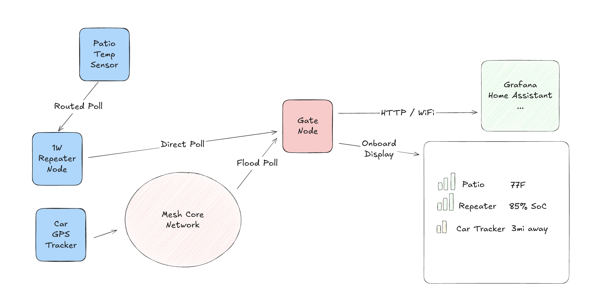

# Muninn Gate

Muninn Gate is a small embedded telemetry gateway that bridges MeshCore-compatible telemetry into observability systems.

It runs on a LoRa-capable board, polls configured MeshCore-compatible nodes for telemetry, and exposes the latest readings over WiFi/HTTP or USB serial. A local display can show selected gateway and node metrics, turning the gate node into a small field metrics hub. Configuration controls radio settings, producer identities, polling behavior, display output, HTTP access, and which telemetry values are surfaced locally.

Producer telemetry is channel-aware. Muninn Gate retains up to six MeshCore/LPP
channels per producer: MCU battery/temperature, SHT4x temperature/humidity,
BME680 temperature/humidity/pressure/gas, and three INA3221 power-monitor
channels. Serial JSON exposes a compact default value per producer plus the
full channel list; Prometheus sensor metrics use channel labels so dashboards
can distinguish individual readings.



## Layout

- `crates/muninn-gate-core`: platform-independent config, telemetry, runtime state, polling, metrics, output helpers, and the `GateFirmwareVariant` trait.
- `crates/muninn-gate-firmware`: thin firmware binary entrypoint that selects a board variant using Cargo features.
- `crates/muninn-gate-ui`: platform-independent local display UI renderer for compact OLED pages.
- `crates/muninn-gate-board-heltec-v4`: WiFi LoRa 32 V4.x board variant, capability declaration, ESP32 runner selection, and board-specific TX power level mapping.
- `crates/muninn-gate-platform-esp32`: reusable ESP32-S3 platform services such as startup, WiFi, HTTP, storage, and serial.
- `crates/muninn-mesh-sx126x`: low-level SX126x register and device driver crate.
- `crates/muninn-mesh-radio`: platform-independent SX126x/MeshCore radio orchestration crate.
- `crates/muninn-mesh-meshcore-lib`: MeshCore-compatible protocol/data model crate.
- `config.example.json`: provisioning example.
- `config.example.jsonc`: commented provisioning reference.
- `tools/cli.py`: config template + validator + USB provisioning helper.
- `tools/monitor.py`: ESP32-S3 serial monitor (works around `espflash monitor` non-interactive hangs).
- `docs/codemap`: crate ownership and dependency notes.
- `docs/design`: firmware architecture, runtime flow, and reliability notes.
- `docs/boards`: concrete board notes and hardware policy references.

## Building And Flashing Firmware

Build the WiFi LoRa 32 V4.x firmware:

```sh
cargo build -p muninn-gate-firmware --features heltec-v4 --release
```

Flash a connected ESP32-S3 board:

```sh
cargo espflash flash \
  --flash-size 16mb \
  --partition-table partitions.csv \
  --package muninn-gate-firmware \
  --bin muninn-gate \
  --features heltec-v4 \
  --release \
  --target xtensa-esp32s3-none-elf \
  --chip esp32s3 \
  --monitor
```

The 16 MB flash size and partition table are required for the Heltec V4.x
layout. The table provides the dedicated raw `muninn_cfg` partition used for
persisted USB provisioning config; Muninn Gate does not store its config in NVS.

## Provisioning

Valid uploads are stored in ESP32 flash.

Validate and upload config:

```sh
uv sync
uv run python tools/cli.py config.json /dev/cu.usbmodemXXXX
```

Close any serial monitor first. When the tool says it is waiting, press RESET on the board. The tool waits for USB to reconnect, detects the firmware config window, uploads the file, and prints whether firmware accepted it.

Generate gateway keys and override setup fields:

```sh
uv run python tools/cli.py \
  config.json \
  /dev/cu.usbmodemXXXX \
  --name "Muninn Gate" \
  --wifi "wifi-name" "wifi-password" \
  --keys
```

`--keys` uses the `cryptography` package from the `uv` environment. When the template is `config.json`, generated keys are written back to `config.json`; rerun without `--keys` to keep the same gateway identity.

To generate a config without uploading:

```sh
uv run python tools/cli.py config.json --keys -o config.generated.json
```

## WiFi And HTTP

If `http` is defined, ESP32 firmware starts an HTTP server accessible over WiFi. Endpoints:

```sh
TOKEN=your-token
curl -H "Authorization: Bearer ${TOKEN}" http://<device-ip>/metrics
curl -H "Authorization: Bearer ${TOKEN}" http://<device-ip>/logs
curl -H "Authorization: Bearer ${TOKEN}" http://<device-ip>/poll
```

The ESP32 path uses `esp-wifi` station mode with `smoltcp` DHCP/TCP. The WiFi
driver uses `esp-wifi`'s `esp-alloc` integration and RAM-backed driver state;
the firmware does not add a separate NVS partition for WiFi credentials.

Reliability policy for WiFi, DHCP, HTTP sockets, and direct-only MeshCore TX is
documented in [docs/design/firmware/10_RELIABILITY.md](docs/design/firmware/10_RELIABILITY.md).

## USB Serial

USB serial accepts provisioning commands and emits newline-oriented JSON output. After the device is provisioned, a short boot-time USB update window accepts replacement config before WiFi starts. A valid replacement is stored in flash and applied after reboot.

Accepted config forms:

```json
{"type":"set_config","config":{...}}
```

Useful commands:

```json
{"type":"status"}
{"type":"poll_now"}
{"type":"reboot"}
```

## Example Metrics

```text
# HELP muninn_gate_up Whether the gateway is running.
# TYPE muninn_gate_up gauge
muninn_gate_up 1

# HELP muninn_gate_node_channel_battery_voltage Telemetry producer channel battery voltage.
# TYPE muninn_gate_node_channel_battery_voltage gauge
muninn_gate_node_channel_battery_voltage{node="roof_repeater",channel="1"} 4.08

# HELP muninn_gate_node_channel_voltage Telemetry producer channel voltage.
# TYPE muninn_gate_node_channel_voltage gauge
muninn_gate_node_channel_voltage{node="power_board",channel="4"} 12.1

# HELP muninn_gate_node_channel_current_amps Telemetry producer channel current in amperes.
# TYPE muninn_gate_node_channel_current_amps gauge
muninn_gate_node_channel_current_amps{node="power_board",channel="4"} 0.42

# HELP muninn_gate_node_channel_power_watts Telemetry producer channel power in watts.
# TYPE muninn_gate_node_channel_power_watts gauge
muninn_gate_node_channel_power_watts{node="power_board",channel="4"} 5

# HELP muninn_gate_node_rssi Last received RSSI from telemetry producer.
# TYPE muninn_gate_node_rssi gauge
muninn_gate_node_rssi{node="roof_repeater"} -97

# HELP muninn_gate_tx_power_level Selected board radio TX power level.
# TYPE muninn_gate_tx_power_level gauge
muninn_gate_tx_power_level 14

# HELP muninn_gate_tx_output_dbm Approximate conducted TX power in dBm.
# TYPE muninn_gate_tx_output_dbm gauge
muninn_gate_tx_output_dbm 24.3

# HELP muninn_gate_last_poll_latency_ms Latest completed poll latency in milliseconds.
# TYPE muninn_gate_last_poll_latency_ms gauge
muninn_gate_last_poll_latency_ms 128

# HELP muninn_gate_poll_success_total Successful telemetry polls.
# TYPE muninn_gate_poll_success_total counter
muninn_gate_poll_success_total{node="roof_repeater"} 1
```
