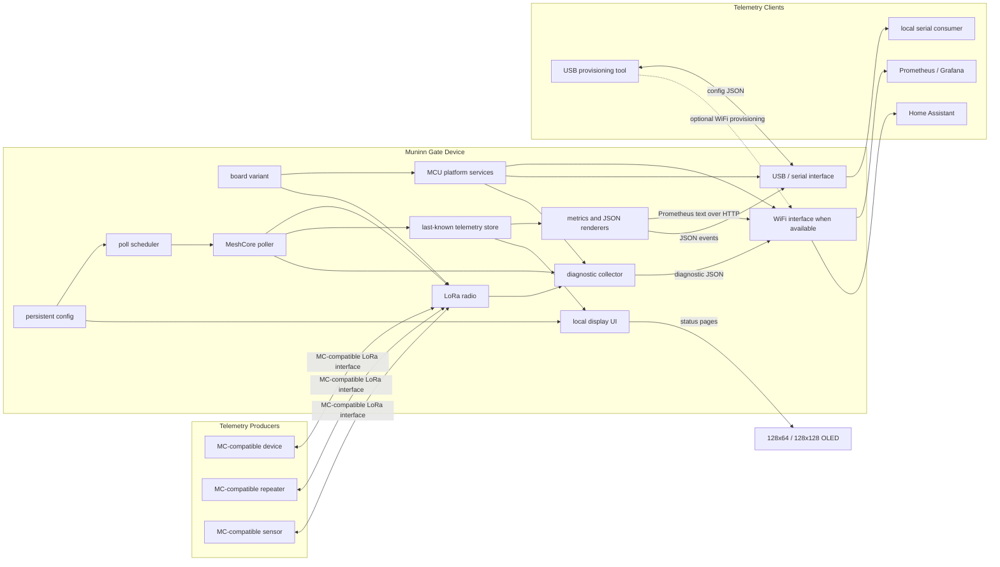

# Firmware Overview

Muninn Gate is an embedded telemetry gateway for MeshCore-compatible telemetry producers. The firmware polls configured producers over a LoRa radio, normalizes the last known telemetry in memory, and exposes that telemetry through Prometheus over WiFi and/or newline-oriented JSON over USB serial.

The initial board target is WiFi LoRa 32 V4.x, ESP32S3 + SX1262 LoRa Node. The architecture is split so another ESP32 board, nRF52 board, or radio family can be added later without moving board-specific code into the platform-independent gateway core.

## Component Docs

- [CODE_STRUCTURE.md](2_CODE_STRUCTURE.md): crate layout, dependency direction, and firmware variant selection.
- [RADIO_MESHCORE.md](3_RADIO_MESHCORE.md): LoRa, radio owner, driver path, and MeshCore polling task boundaries.
- [WIFI_HTTP.md](4_WIFI_HTTP.md): ESP32 WiFi startup, HTTP `/metrics`, and serial JSON output.
- [SCHEDULER.md](5_SCHEDULER.md): polling scheduler responsibilities and runtime loop shape.
- [CONFIGURATION.md](6_CONFIGURATION.md): persistent config, USB provisioning, WiFi provisioning, and JSON format.
- [GATEWAY_METRICS.md](7_GATEWAY_METRICS.md): gateway telemetry, producer/channel metrics, Prometheus names, units, and output semantics.
- [DIAGNOSTICS.md](8_DIAGNOSTICS.md): retained diagnostic events, storage policy, and HTTP debugging surface.
- [DISPLAY_UI.md](9_DISPLAY_UI.md): local display pages, 128x64/128x128 layout policy, and hardware boundary.

## Gateway Setup



## Runtime Data Flow

```text
Config storage
  -> GatewayConfig
  -> PollScheduler
  -> MeshcoreClient
  -> Radio task
  -> MC-compatible telemetry reply
  -> ProducerTelemetry
  -> TelemetryMetrics plus channel metrics
  -> TelemetryStore
  -> Prometheus /metrics, serial JSON, and display UI
```

The telemetry store is the central handoff between producer tasks and output
tasks. Polling updates the store. HTTP and serial read snapshots or update
events. Producer readings use `TelemetryMetrics`, a shared optional-field
superset reused by both `ProducerTelemetry.metrics` and
`ProducerTelemetryChannel.metrics`. Channel metrics are the canonical source for
multi-channel sensors; producer-level metrics are a compact default view for
Prometheus, serial summaries, and the small OLED. Gateway metrics are stored
beside producer telemetry so output systems can see gateway health, radio
counters, heap/free memory, uptime, selected TX power level/output, poll success
rates, and poll latency. The metric contract is documented in
[GATEWAY_METRICS.md](7_GATEWAY_METRICS.md).

The local display renderer consumes the same config, runtime state, and telemetry snapshot as HTTP and serial. The current UI target is a compact 128x64 OLED page set; the renderer also supports a 128x128 text frame so larger board variants can show more rows without changing the status model.

On ESP32-S3, the current reliability baseline keeps WiFi, HTTP, smoltcp, LoRa,
scheduler, serial, and display refresh in one cooperative service loop. That
choice is intentional: field testing showed the proprietary WiFi runtime was
more stable when the SX1262 owner was serviced cooperatively instead of running
as an independent APP-core task.

`GatewayRuntimeState` tracks the provisioning/serving state for displays, HTTP output, and serial diagnostics. The expected boot progression is `Unprovisioned` when no valid config exists, `Provisioned` after config validation, `Serving` after HTTP or USB serial output is active, or `Error` when startup cannot continue.

The current code has the trait boundaries, ESP32-S3 WiFi station startup,
persisted USB serial config upload and replacement, raw `muninn_cfg` flash
config storage, a DHCP-backed HTTP listener for `/metrics`, `/logs`, and
`/poll`, serial JSON output, a small RAM diagnostic ring, a shared telemetry
store, Heltec V4.x radio/display resource retention, OLED status pages, and a
cooperative radio/MeshCore owner. HTTP-enabled boots bring up `esp-wifi`, DHCP,
the HTTP socket pool, and the SX1262 owner, then service all of them from one
loop. The radio owner initializes the SX1262 path, keeps RX polling alive,
queues received frames, serializes queued TX with airtime spacing, and
publishes radio health. The scheduler consumes `/poll` requests, sends official
MeshCore login and telemetry requests through the radio queue, matches encrypted
responses, records concise poll errors, passively drains matched RX
observations into telemetry, and refreshes serial/display output. Outbound
MeshCore TX is direct-only by firmware policy.
